

  

    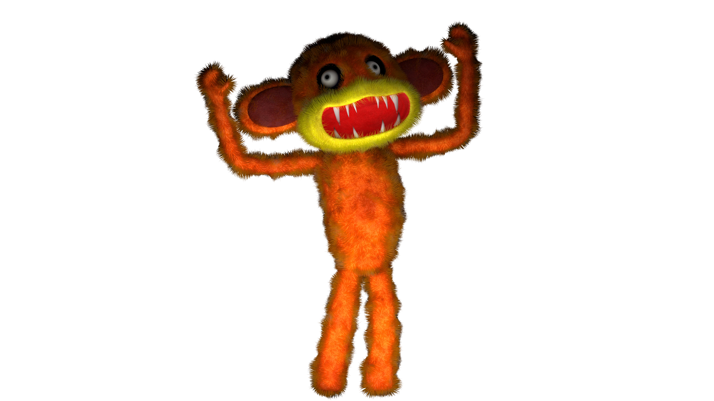
    When he screams, he activates the omniscience of all the Toy Zombies on the map until the scream ends, however, this is the only Toy Zombie that doesn't detect you well if your flashlight is off (although it will probably kill you if you touch it). When it's chasing you, its speed isn't a real threat if you start running.
  

  

    <h3 class="cyber-title">FEATURES:</h3>
    
<b>Name:</b> Mono
        
    
<b>Species:</b> Monkey

    
<b>Abilities:</b> Warning scream, calls the others

    
<b>Weaknesses:</b> He is slower than you when you run

  

  

    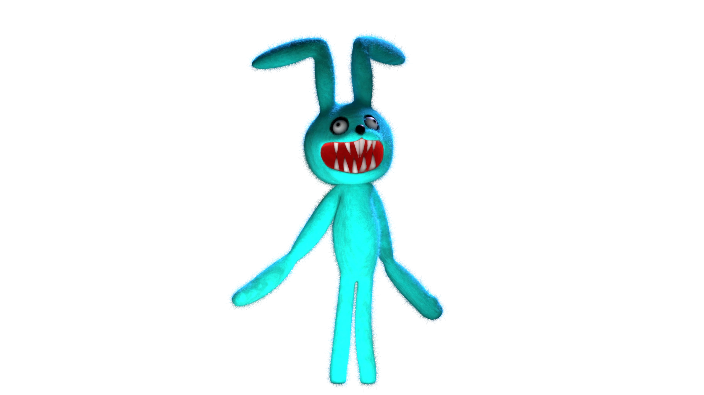
    In the first few hours Plushnee mimics your movement state; if you walk, she walks, if you run, she runs. However, as the difficulty increases, she will give you less opportunity to move, and will start running as soon as you move, even just a little.
  

  

    <h3 class="cyber-title">FEATURES:</h3>
    
<b>Name:</b> Plushnee
        
    
<b>Species:</b> Rabbit

    
<b>Abilities:</b> Very fast

    
<b>Weaknesses:</b> If you stay still, he can't see you

  

  

    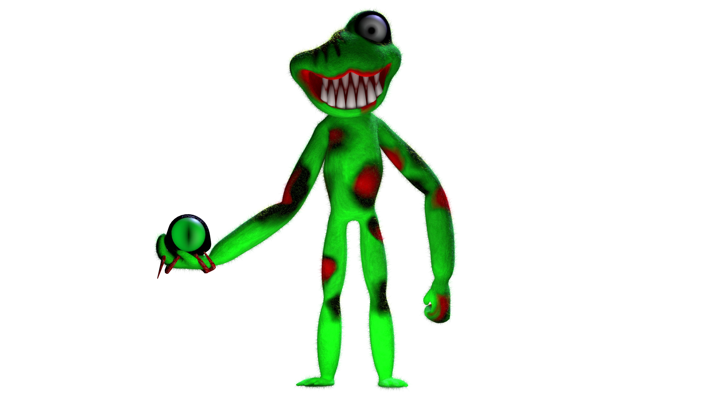
    Its initial phase is "Frog's Eye" This eye will act as a minion that will alert Frog to your location every time it sees you, and obviously, the greater the difficulty, the greater its range of vision (even with the flashlight off).
  

  

    <h3 class="cyber-title">FEATURES:</h3>
    
<b>Name:</b> Frog
        
    
<b>Species:</b> Toad

    
<b>Abilities:</b> Uses his watcher eye from a distance

    
<b>Weaknesses:</b> If the eye doesn't see you, you are almost invisible

  

  

    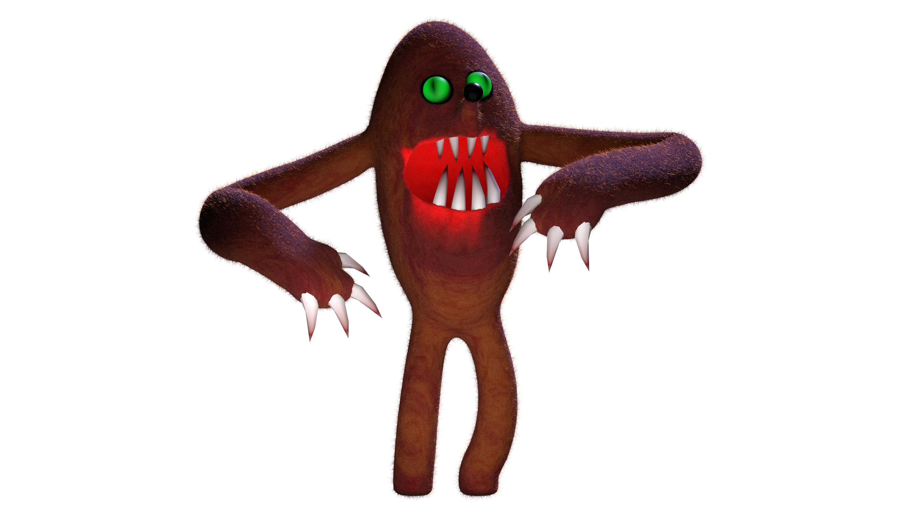
    You just need to flash him in the face as many times as you want to stun him. However, it's the fastest Toy Zombie in the vents, so be very careful when you go through there.
  

  

    <h3 class="cyber-title">FEATURES:</h3>
    
<b>Name:</b> Toplush
        
    
<b>Species:</b> Mole

    
<b>Abilities:</b> Super speed in vents or enclosed spaces

    
<b>Weaknesses:</b> If you shine the flashlight very close to him, you can blind him

  

  

    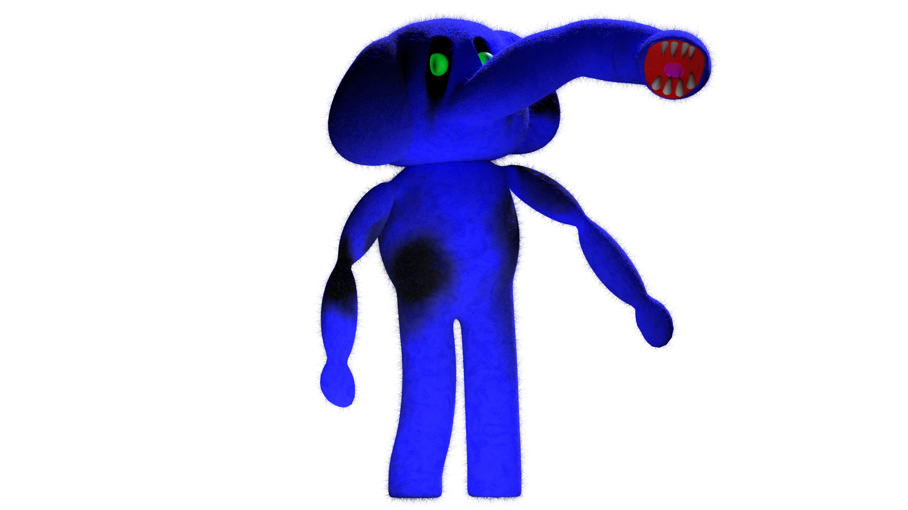
    He will always be stalking behind your line of sight, so you must be very attentive to the sounds behind you, because it could be him peeking around a corner.
  

  

    <h3 class="cyber-title">FEATURES:</h3>
    
<b>Name:</b> BoBiGo
        
    
<b>Species:</b> Elephant / Anteater / possibly a dog?

    
<b>Abilities:</b> Follows you from behind

    
<b>Weaknesses:</b> If you shine the light on him while he is lurking, he will disappear

  

  

    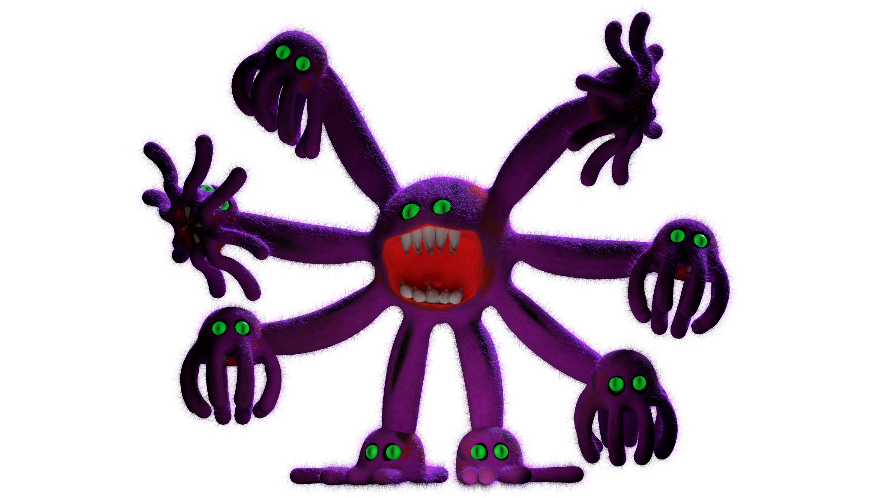
    She can launch up to 6 Mini Pulps to slow you down; the more they accumulate on your screen, the slower you will become.
  

  

    <h3 class="cyber-title">FEATURES:</h3>
    
<b>Name:</b> Pulp
        
    
<b>Species:</b> Octopus

    
<b>Abilities:</b> Throws Mini Pulps that slow you down

    
<b>Weaknesses:</b> She is slow

  

  

    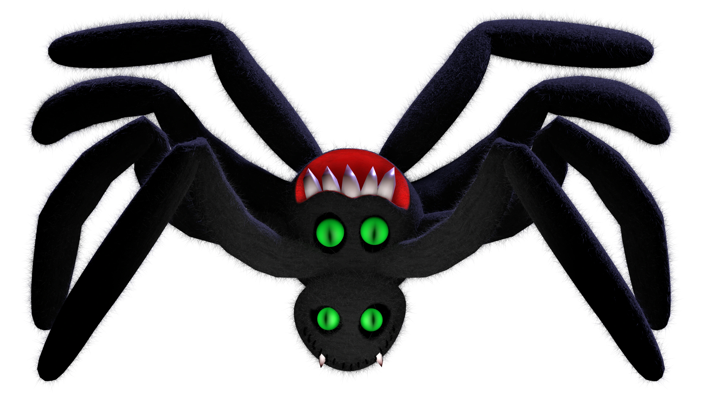
    It can walk on the ceilings, and when she's in this state she can dash towards you, which you can use to dodge it and make it lose sight of you.
  

  

    <h3 class="cyber-title">FEATURES:</h3>
    
<b>Name:</b> Spiderplush
        
    
<b>Species:</b> Tarantula

    
<b>Abilities:</b> Very fast when running on ceilings

    
<b>Weaknesses:</b> If you dodge her, she loses sight of you

  

  

    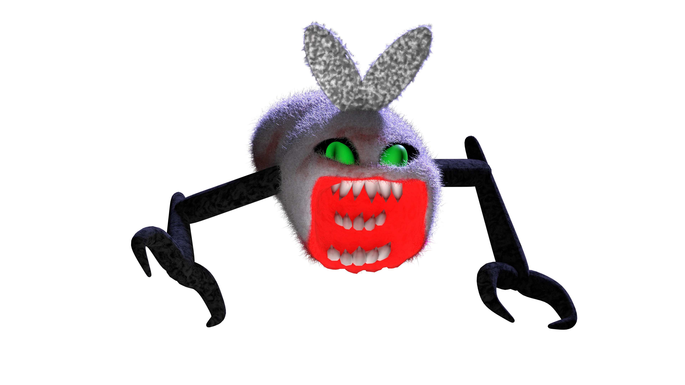
    She will always try to dash towards you, you just have to get out of her way and let her crash into a wall.
  

  

    <h3 class="cyber-title">FEATURES:</h3>
    
<b>Name:</b> Mosci
        
    
<b>Species:</b> Fly

    
<b>Abilities:</b> Lunges at the player in a straight line

    
<b>Weaknesses:</b> You can dodge her

  

  

    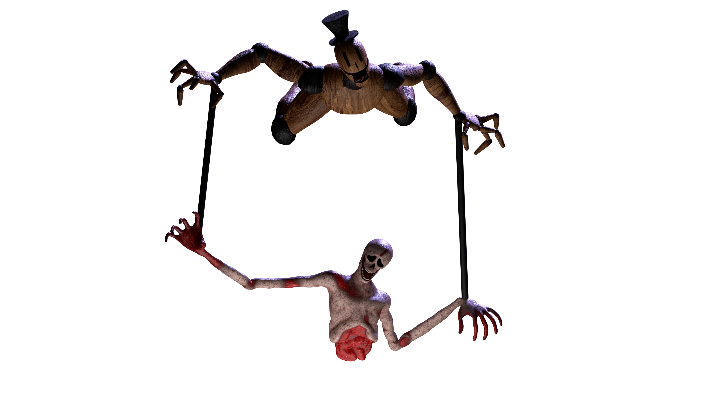
    It is completely omniscient. it will turn on your flashlight when you are near of it, and it will drop a corpse to try to trap you. When it does this, make sure you turn off your flashlight to prevent it from dash towards at you.
  

  

    <h3 class="cyber-title">FEATURES:</h3>
    
<b>Name:</b> Mannequin
        
    
<b>Species:</b> Wooden Mannequin

    
<b>Abilities:</b> Can turn on your flashlight, attacks from above

    
<b>Weaknesses:</b> If you turn off the flashlight, he loses sight of you

  

  

    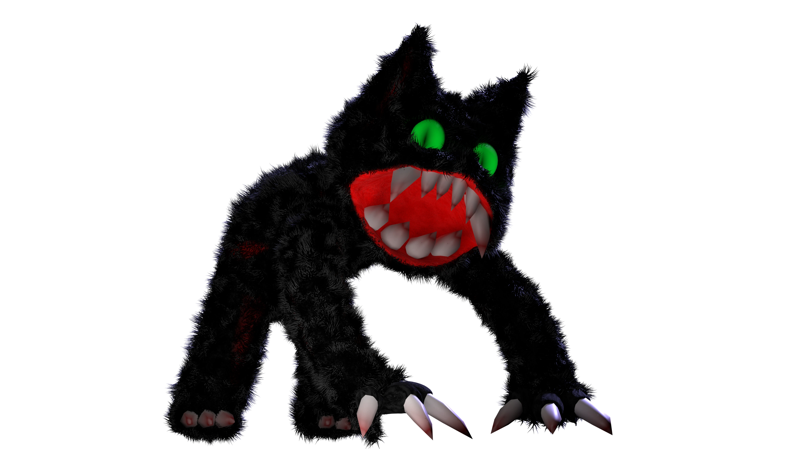
    When he sees you he will take a running start to jump towards you, as soon as he is in the air flash his face to stun him.
  

  

    <h3 class="cyber-title">FEATURES:</h3>
    
<b>Name:</b> Mike the Cat
        
    
<b>Species:</b> Cat

    
<b>Abilities:</b> Lunges at you, runs very fast

    
<b>Weaknesses:</b> When he jumps at you, shine the light on him and he will stop

  

  

    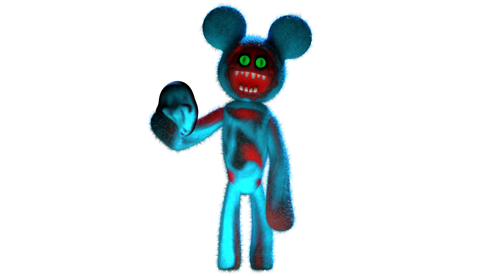
    If you hear him say HUSHHHHHHH, avoid sprint in any way; he can hear you sprinting even when your flashlight is off.
  

  

    <h3 class="cyber-title">FEATURES:</h3>
    
<b>Name:</b> MouseMask
        
    
<b>Species:</b> Mouse

    
<b>Abilities:</b> Has super sensitive hearing

    
<b>Weaknesses:</b> If you don't run, he won't hear you

  

  

    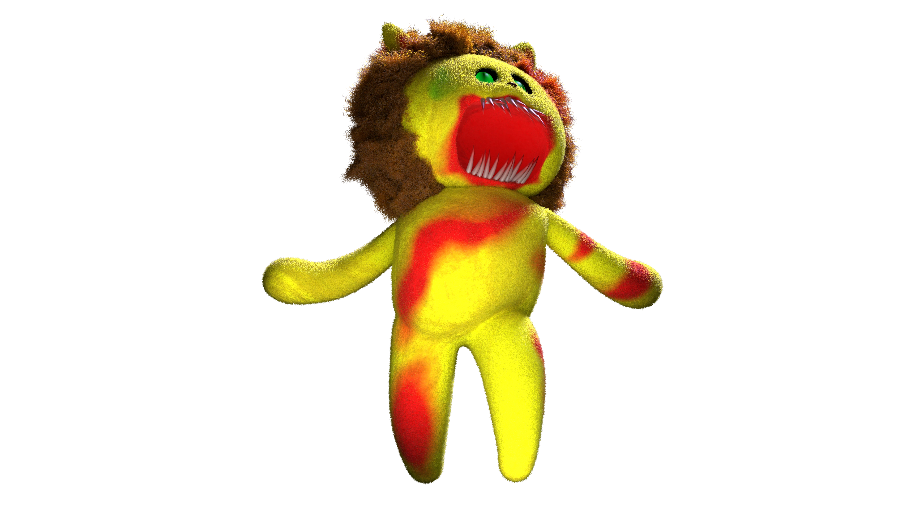
    The more difficulty, the more sensitive he will be to the noises you make, but generally, to avoid waking him up, you just need to keep the flashlight off when you hear him snoring.
  

  

    <h3 class="cyber-title">FEATURES:</h3>
    
<b>Name:</b> Lionmion
        
    
<b>Species:</b> Lion

    
<b>Abilities:</b> If you wake him up, he runs towards you at full speed

    
<b>Weaknesses:</b> Usually spends his time sleeping at the emergency exits

  

  

    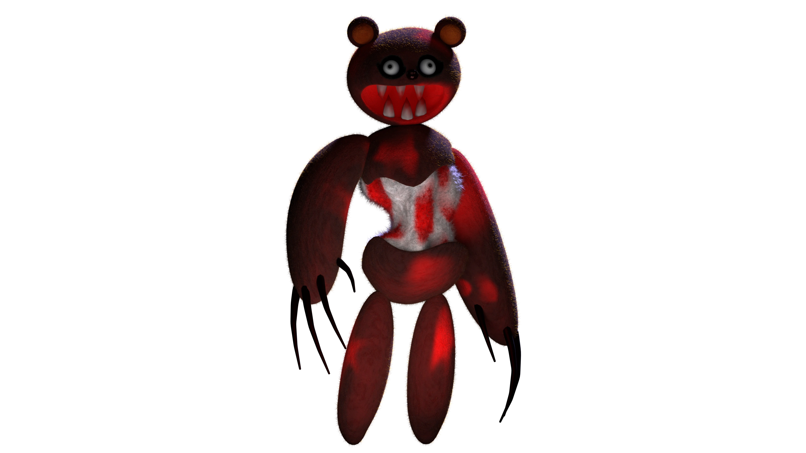
    You must maintain eye contact with her at all times; you can only do this with the flashlight on, otherwise it won't work. Stay like this for a while until she leaves, or else find a hiding place or some way to get rid of her.
  

  

    <h3 class="cyber-title">FEATURES:</h3>
    
<b>Name:</b> Bear
        
    
<b>Species:</b> Bear

    
<b>Abilities:</b> Once she marks you, she doesn't stop following you

    
<b>Weaknesses:</b> Look at her with the flashlight on and she will disappear

  

  

    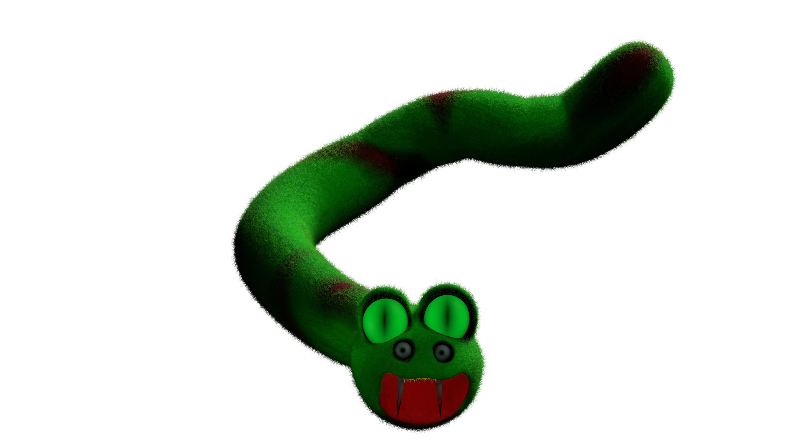
    He only attacks in the atrium area, but the longer you stay there, the faster he becomes, making it easier for it to kill you.
  

  

    <h3 class="cyber-title">FEATURES:</h3>
    
<b>Name:</b> Snakeplush
        
    
<b>Species:</b> Titanoboa

    
<b>Abilities:</b> Lunges in circles until reaching his target

    
<b>Weaknesses:</b> Found only in the atrium

  

  

    
    ???
  

  

    <h3 class="cyber-title">FEATURES:</h3>
    
<b>Name:</b> ???
        
    
<b>Species:</b> ???

    
<b>Abilities:</b> ???

    
<b>Weaknesses:</b> ???

  

