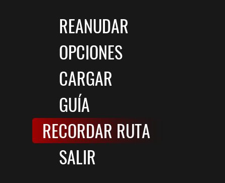

# Mecánicas del juego

## MECÁNICA BÁSICA:

### VENTILACIONES

Algunos Toy Zombies pueden entrar por las rejillas de ventilación
Solo hay 5 de ellos que pueden hacerlo, y 2 de ellos son versiones Mini de los originales, estos dentro de las rejillas de ventilación pueden matarte sin problemas.

### MOVIMIENTO

Algunos Toy Zombies son demasiado rápidos; sin embargo, puedes usar su mecánica de dispersión a tu favor, porque si mantienes al más rápido detrás del más lento, el más rápido intentará encontrar otro camino para evitar chocar con el Toy Zombie que está frente a él.

### ASECHO

Si tu linterna está apagada, es probable que haya stalkers en las esquinas. Cuando están en este estado, se les iluminará la cara. 
Alumbrales con la linterna antes de que salgan de ese estado y te persigan.

### PERSECUCIÓN

La clave para escapar de una persecución es despistarlos. Busca una pared o un lugar donde no puedan verte y suelta el botón de correr para dejar de gritar. Esto aumentará considerablemente las posibilidades de que salgan de este estado. Sin embargo, hacerlo demasiado cerca de ellos no te salvará. 
>Esconderse en lockers o cualquier otro escondite no funcionará en este estado.

### VISION

Cuando te detectan y luego te pierden de vista, investigan la zona para averiguar dónde podrías estar escondido. Después, vuelven a su modo de patrullaje aleatorio. 
Otra ventaja de su visión es que pueden verte si estás muy cerca de ellos (incluso con la linterna apagada, así que ten mucho cuidado si te acercas a uno).

### SENTIDO

Son extremadamente sensibles al ruido, puedes lanzarles objetos y usarlos como distracción o puedes encender la linterna para llamarlos al lugar que quieres que vayan.

## JUGABILIDAD:

### LINTERNA

Como el centro comercial está bastante oscuro, siempre es mejor tener la linterna encendida. Si la apagas, atraerás a los stalkers, pero si la enciendes, harás ruido y serás más fácil de detectar. Por lo tanto, necesitas encontrar un equilibrio entre mantener la linterna encendida y apagada.

### ADRENALINA

Cada 5 segundos que sigas corriendo tu personaje entrará en modo adrenalina y tendrás un aumento de velocidad, sin embargo, esto hace que hagas un ruido extremadamente fuerte.

### CORRER SIGILOSAMENTE

Puedes correr sigilosamente si mantienes tu linterna apagada mientras corres, pero si estás en modo adrenalina no importa si tu linterna está apagada, harás ruido de todos modos.

## HUD

### NOISE HUD

Esta parte del HUD te dirá en qué dirección está el Toy Zombie más cercano. Cuanto más cerca esté, más opaco se volverá.

### SOUND HUD

Esta parte del HUD indica cuánto ruido haces:

Nivel 1: Mínimo, solo Mousemask puede oírte.

Nivel 2: Los enemigos ahora pueden saber dónde estás y buscarán posibles escondites.

Nivel 3: Ahora pueden conocer tu ubicación.

Nota: Cuando el HUD se pone rojo, significa que te están persiguiendo.

## HORAS

### SAVE ERIC

Cada vez que te acerques a ellos se te dará la oportunidad de salvarlo. No los pases por alto, ya que si no activas uno en la hora que corresponde Eric morirá.

### MINIJUEGOS
<video src="../img/minijuegos.webm" class="cyber-img" autoplay loop muted playsinline></video>

Suelen estar cerca de la tarjeta de acceso una vez pasas la Hora.

Nota: Sólo funcionan en orden, si te saltaste uno, el resto quedará fuera de servicio.

## OPCIONES

###RECORDAR RUTA

Si te olvidas la última ruta que se mostró, la puedes volver a ver desde el menú de PAUSA.

