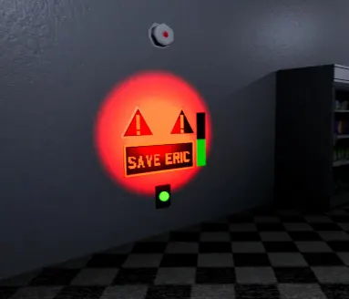
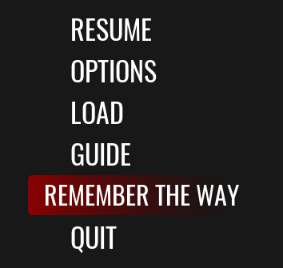

# Game Mechanics

## BASIC MECHANICS:

### VENTS

Some Toy Zombies can enter through the ventilation grates.
There are only 5 of them that can do this, and 2 of them are Mini versions of the originals; these can kill you without a problem while inside the vents.

### MOVEMENT

Some Toy Zombies are extremely fast; however, you can use their dispersion mechanic to your advantage. If you keep the fastest one behind the slowest one, the fastest one will try to find another path to avoid colliding with the Toy Zombie in front of it.

### STALKING

If your flashlight is off, there are likely stalkers lurking in the corners. When they are in this state, their faces will light up. 
Shine your flashlight on them before they snap out of that state and start chasing you.

### PURSUIT

The key to escaping a chase is to lose them. Find a wall or a place where they can't see you and release the run button to stop screaming. This will significantly increase the chances of them leaving this state. However, doing it too close to them won't save you. 
>Hiding in lockers or any other hiding spot will not work in this state.

### VISION

When they detect you and then lose sight of you, they will investigate the area to figure out where you might be hiding. Afterwards, they will return to their random patrol mode. 
Another advantage of their vision is that they can see you if you are very close to them (even with the flashlight off, so be very careful if you get close to one).

### SENSES

They are extremely sensitive to noise. You can throw objects and use them as a distraction, or you can turn on the flashlight to lure them to a specific place.

## GAMEPLAY:

### FLASHLIGHT

Since the mall is quite dark, it is always better to keep the flashlight on. If you turn it off, you will attract stalkers, but if you turn it on, you will make noise and be easier to detect. Therefore, you need to find a balance between keeping the flashlight on and off.

### ADRENALINE

Every 5 seconds you keep running, your character will enter adrenaline mode, giving you a speed boost. However, this causes you to make an extremely loud noise.

### STEALTH RUNNING

You can run stealthily if you keep your flashlight off while running, but if you are in adrenaline mode, it doesn't matter if your flashlight is off—you will make noise anyway.

## HUD

### NOISE HUD

This part of the HUD will tell you in which direction the nearest Toy Zombie is. The closer it is, the more opaque it will become.

### SOUND HUD

This part of the HUD indicates how much noise you are making:

Level 1: Minimum, only MouseMask can hear you.

Level 2: Enemies can now know where you are and will search potential hiding spots.

Level 3: Now they know your exact location.

Note: When the HUD turns red, it means you are being chased.

## HOURS

### SAVE ERIC

Every time you get close to them, you will be given the chance to save him. Do not ignore them, because if you don't activate one in the corresponding hour, Eric will die.

### MINIGAMES
<video src="../../img/minijuegos.webm" class="cyber-img" autoplay loop muted playsinline></video>

They are usually located near the keycard once you pass the Hour.

Note: They only work in order. If you skip one, the rest will be out of service.

## OPTIONS

### REMEMBER ROUTE

If you forget the last route that was shown, you can view it again from the PAUSE menu.

