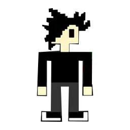

# John

  

    
    John es el protagonista principal de Toy Zombies.
  

  

    <h3 class="cyber-title">Detalles</h3>
    
<b>Nombre:</b> John Bianchi

    
<b>Rol:</b>Protagonista

    
<b>Equipamiento:</b> Linterna

  

### Historia
Luego de que Alan afirmara haber recibido mensajes de su hermano Aaron, aparentemente desaparecido en el Animall Shopping, John se sumó a la búsqueda. Si bien en principio se burló de los supuestos mensajes y tampoco creyó en las innumerables historias fantásticas del lugar, nunca imaginó el verdadero horror que tendría enfrente.

# Alan

  

    
    Alan es el hermano de Aaron.
  

  

    <h3 class="cyber-title">Detalles</h3>
    
<b>Nombre:</b> Alan García

    
<b>Rol:</b>Personaje secuandario

    
<b>Equipamiento:</b>S/N

  

### Historia
Alan estuvo recibiendo mensajes en las noches, primero creía que se trataba de pesadillas, pero cada vez se hacía mas insoportable. El mensaje, "Alan estoy atrapado, ayúdame" con la voz de su hermano Aaron. El último lugar conocido era su trabajo en AniMall's Shopping. Luego de convencer a sus amigos John y Eric que lo que sentía es verdad, emprenden juntos la busqueda.

# Eric

  

    
    Es el mejor amigo de John y Alan.
  

  

    <h3 class="cyber-title">Detalles</h3>
    
<b>Nombre:</b> Eric

    
<b>Rol:</b>Personaje secuandario

    
<b>Equipamiento:</b>Pistola

  

### Historia
Eric inmediatamente se lanzó a la busqueda de Aaron sin dudarlo, para ello fue preparado con una pistola, si algo o alguien se quisiera meter con sus amigos se enfrentaría al poder de sus balas, el problema es que las criaturas que los esperan no estaban en el plan. Sin duda Eric lo va a dejar todo por sus amigos.